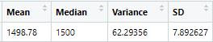
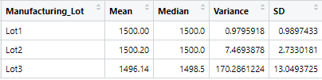

# MechaCar_Statistical_Analysis

Total Summary            |  Lot Summary
:-------------------------:|:-------------------------:
  |  
:-------------------------:|:-------------------------:
* The variance for the data of all manufacturing lots tested aggregately is 76.23, which is well under 100 pounds per square inch. | * The variance of Lots 1 and 2 are well below the 100 pounds per square inch threshold, however the opposite could be said about Lot 3 which is over that threshold by 120 pounds per square inch.

