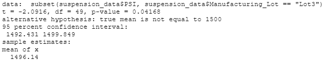

# MechaCar_Statistical_Analysis

## Linear Regression for Predict MPG

#### Statistics :

  * R-squared value = .715
  * p-value is 5.32e-11
  * Slope is not equal to zero 
  
#### Statistics Explained

 * The R-squared value is .715 which means that roughly 71% of the predictions made by this Linear Regression model will be correct therefor it does a very decent   job at preidcting outcomes but it is not the best it could be.
 * Since the p value is lower than significance level of .05, we must reject the null hypothesis which means slope is not equal to zero implying that as the y value does not stay constant as x increases. In other words that there is a significant relationship between the dependent and independent variables.
  

## Summary Statistics for Suspension Coils

Total Summary            |  Lot Summary
:-------------------------:|:-------------------------:
  |  

* Based on the Total Summary the variance is 62.3 so it is within range but taking a look at each lot individually we can see that Lot 1 and 2 meet the design specifications with variances of .9 and 7.4 while Lot 3 far exceeds specifications.  

## T Tests for Suspension Coils

Lot 1 | Lot 2 | Lot 3
:-------------------------:|:-------------------------:|:-------------------------:
||

* Taking a look at the three p-value's of the t-tests for lot 1,2 are statistically similar to the 1500 psi where as lot 3 is statistically different.

Lot Summary

* Basd on the p value of the lot summary t-test, we can conclude that it does not differ much from the psi mean, so there is no evidence to reject null hypothesis.

## Study Design: MechaCar vs Competition

I think an interesting and useful study would be to see how well MechaCar performs on highways vs city miles. First i would have to run a test which calculates how many miles it gets on streets versus the freeway. Then next it would be logical to create a hypothesis in wich compares the results from each test. Based on the test the null hypothesis would be based on if the city / freeway miles are higher or lower than the average of the two. This way we could truly test where the bet mileage is achieved.
